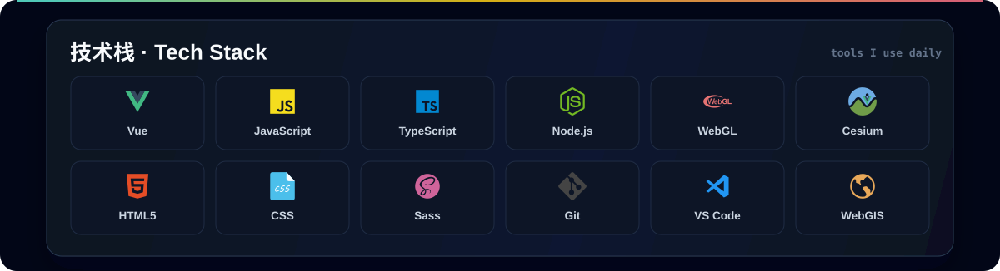
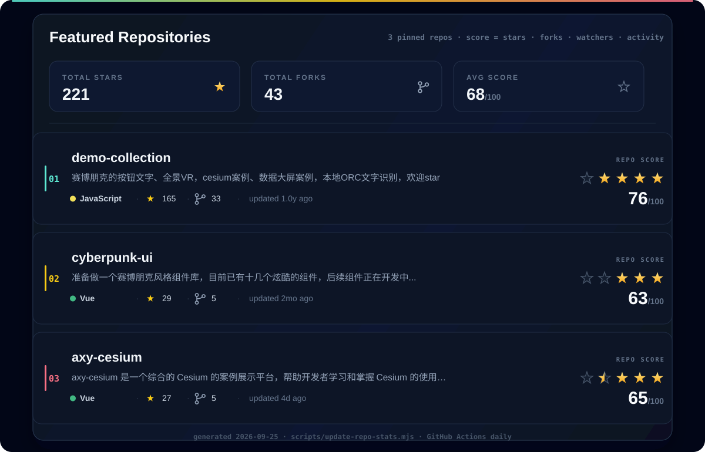
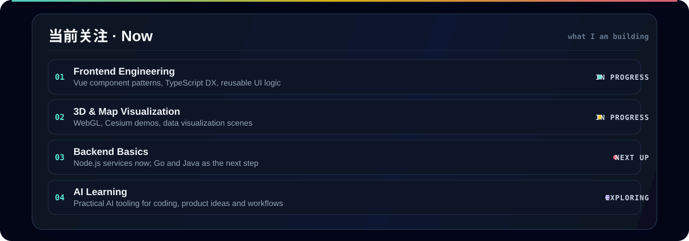

<!--
Profile README stability notes:
- All visual assets live in ./images — third-party badge services are intentionally avoided.
- The repository showcase below is generated by scripts/update-repo-stats.mjs
  and refreshed daily by GitHub Actions (.github/workflows/update-profile-stats.yml).
- The tech stack panel is composed by scripts/build-tech-stack.mjs from the icon files in ./images.
- Only three repositories are counted: demo-collection, cyberpunk-ui, axy-cesium.
  The repo score is a local 0-100 blend of stars / forks / watchers / push recency.
-->

  

  <b>Frontend 工程师 / 软件开发者 · 坐标中国</b> 
  I craft interactive UI and 3D visualization with Vue, TypeScript, Node.js, WebGL and Cesium — 
  currently exploring AI, Python, Go and Java.

  
  
  
  

## 技术栈 · Tech Stack

  

## 精选仓库 · Featured Repos

  

  评分由本地脚本基于 stars / forks / watchers / 更新活跃度 计算，每日通过 GitHub Actions 自动刷新，仅统计以下三个仓库。

- **[demo-collection](https://github.com/whanxueyu/demo-collection)** — 收集前端效果、全景 VR、Cesium 案例、数据大屏和 OCR 示例。
- **[cyberpunk-ui](https://github.com/whanxueyu/cyberpunk-ui)** — 一个赛博朋克风格的组件库，持续完善组件和交互细节。
- **[axy-cesium](https://github.com/whanxueyu/axy-cesium)** — Cesium 可视化案例展示平台，沉淀常见功能和业务场景。

## 当前关注 · Now

  

## 联系 · Contact

  欢迎通过 <a href="https://github.com/whanxueyu/whanxueyu/issues">Issues</a> 交流问题，也可以在 <a href="https://juejin.cn/user/4169764191092407">掘金</a> 找到我。 
  whanxueyu · crafted with curiosity &amp; open source

