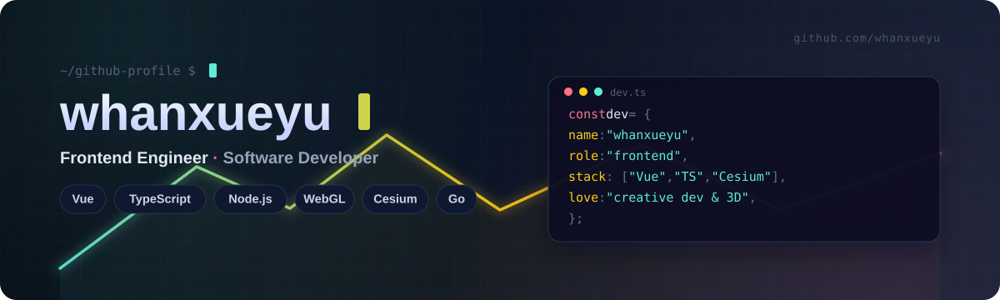
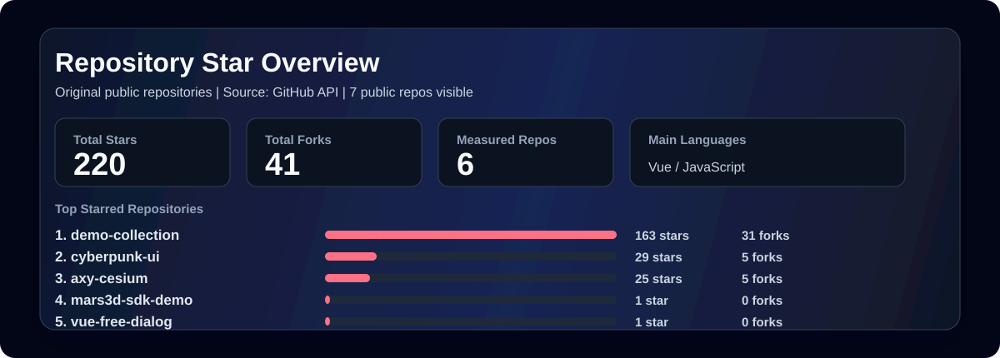

<!--
Profile README stability note:
- Visual assets are stored locally in ./images.
- Third-party generated image badges are intentionally avoided.
-->

  

<h3 align="center">Hi, I'm whanxueyu</h3>

  Computer Engineer & Software Developer from China. 
  I mainly work with Vue, JavaScript, TypeScript and Node.js, and I am exploring WebGL, Cesium, AI, Python,Go and Java.

  <a href="https://github.com/whanxueyu?tab=repositories">Repositories</a>
  |
  <a href="https://axydemo.netlify.app">Demo Collection</a>
  |
  <a href="https://juejin.cn/user/4169764191092407">Juejin</a>
  |
  <a href="https://github.com/whanxueyu/whanxueyu/issues">Issues</a>

## 技术栈

<table>
  <tr>
    <td align="center" width="96">
       
      Vue
    </td>
    <td align="center" width="96">
       
      JavaScript
    </td>
    <td align="center" width="96">
       
      TypeScript
    </td>
    <td align="center" width="96">
       
      Node.js
    </td>
    <td align="center" width="96">
       
      WebGL
    </td>
    <td align="center" width="96">
       
      Cesium
    </td>
  </tr>
  <tr>
    <td align="center" width="96">
       
      HTML5
    </td>
    <td align="center" width="96">
       
      CSS
    </td>
    <td align="center" width="96">
       
      Sass
    </td>
    <td align="center" width="96">
       
      Git
    </td>
    <td align="center" width="96">
       
      VS Code
    </td>
    <td align="center" width="96">
       
      WebGIS
    </td>
  </tr>
</table>

## 仓库统计

<!-- Run `node scripts/update-repo-stats.mjs` to refresh this local stats image. -->

  

## 当前关注

| Direction | What I am building |
| --- | --- |
| Frontend Engineering | Vue component patterns, TypeScript DX, reusable UI logic |
| 3D & Map Visualization | WebGL, Cesium demos, data visualization scenes |
| Backend Basics | Node.js services now; Go and Java as the next step |
| AI Learning | Practical AI tooling for coding, product ideas and workflows |

## 精选项目

| Project | Focus | Description |
| --- | --- | --- |
| [demo-collection](https://github.com/whanxueyu/demo-collection) | Creative demos | 收集前端效果、全景 VR、Cesium 案例、数据大屏和 OCR 示例。 |
| [cyberpunk-ui](https://github.com/whanxueyu/cyberpunk-ui) | Component library | 一个赛博朋克风格的组件库，持续完善组件和交互细节。 |
| [axy-cesium](https://github.com/whanxueyu/axy-cesium) | Cesium platform | Cesium 可视化案例展示平台，沉淀常见功能和业务场景。 |
| [vue-free-dialog](https://github.com/whanxueyu/vue-free-dialog) | Vue component | 轻量灵活的弹窗组件，支持拖拽、缩放、折叠和动画。 |

## 联系

  欢迎通过 <a href="https://github.com/whanxueyu/whanxueyu/issues">Issues</a> 交流问题，也可以在 <a href="https://juejin.cn/user/4169764191092407">掘金</a> 找到我。

